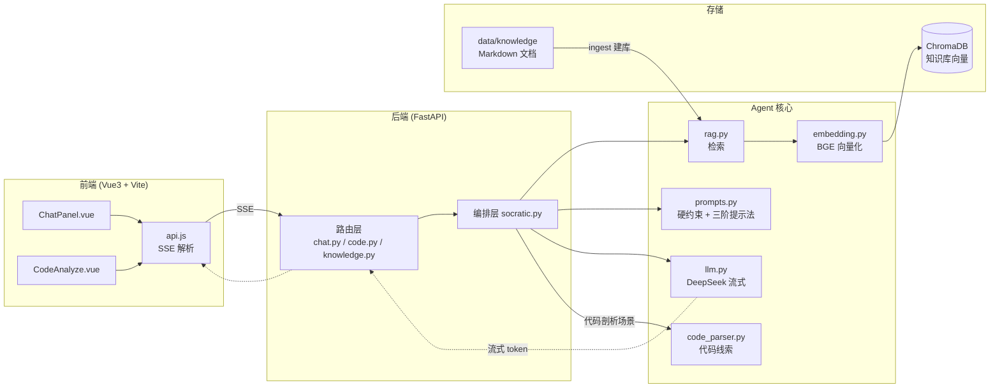

# TELLME.md —— 智育助教 Agent 项目说明

> **项目定位**：为学习《数据结构与算法》的学生打造的「只启发、不泄题」智能 AI 助教。
> 基于 RAG（检索增强生成）与苏格拉底教学法，通过硬性 Prompt 约束保证助教**绝不直接给出 C/C++ 完整代码**，而是用提问、逻辑诊断、伪代码引导学生自主 Debug。
>
> 本文件面向新接手的开发者，说明技术栈、项目结构、运行方式与 Agent 技术体系。

---

## 1. 技术栈 (Tech Stack)

### 分层总览

| 层级 | 技术 | 版本（声明） | 版本（本机实测） | 用途 |
|---|---|---|---|---|
| 语言层 | Python | 3.12 | 3.12.6 | 后端 |
| 语言层 | Node.js | 18+ | v22.19.0 | 前端构建 |
| 后端框架层 | FastAPI | >=0.110 | 0.128.0 | REST API + SSE 流式 |
| 后端框架层 | Uvicorn | >=0.30 | 0.46.0 | ASGI 服务器 |
| 大模型层 | DeepSeek（`deepseek-chat`） | — | — | 苏格拉底助教底层 LLM |
| 大模型层 | OpenAI SDK | >=1.50 | 2.16.0 | 调用 DeepSeek（OpenAI 兼容） |
| 向量化层 | sentence-transformers | >=3.0 | 3.0.0 | 加载 BGE 向量模型 |
| 向量化层 | BGE 模型 `BAAI/bge-small-zh-v1.5` | — | — | 中文文本向量化（512 维） |
| 向量库层 | ChromaDB | >=0.4.24 | 0.4.24 | 向量持久化 + 相似度检索 |
| 深度学习层 | PyTorch | — | 2.12.0 | sentence-transformers 运行时依赖 |
| 配置层 | python-dotenv | >=1.0 | 1.2.1 | 读取 `.env` |
| 数据校验层 | Pydantic | >=2.7 | 2.12.5 | 请求体模型 |
| 前端框架层 | Vue 3 | ^3.5.13 | — | UI |
| 前端构建层 | Vite | ^6.0.7 | 6.4.3 | 开发/构建 |
| 前端工具库 | marked | ^15.0.4 | — | Markdown 渲染 |
| 前端工具库 | highlight.js | ^11.11.1 | — | 代码高亮 |

> 说明：后端依赖在 `backend/requirements.txt` 中声明的是**最低版本约束**（`>=`），本机实际安装版本见上表「本机实测」列，已全部验证通过。

### 关键选型说明

- **DeepSeek 而非 OpenAI/Anthropic**：国内可直连、便宜、OpenAI 兼容接口，代码用 `openai` SDK 换 `base_url` 即可调用。
- **本地 BGE 而非 API 向量化**：DeepSeek 不提供 embedding 接口，本地 BGE 免费离线、中文效果好。
- **ChromaDB 而非 FAISS/Pinecone**：本地持久化、零配置、Python 原生。

---

## 2. 项目结构 (Project Structure)

```
大三上项目实践/
├── backend/                          # FastAPI 后端
│   ├── .env                          # 环境变量（含真实 DeepSeek key，勿提交）
│   ├── .env.example                  # 环境变量模板
│   ├── requirements.txt              # Python 依赖声明
│   ├── app/
│   │   ├── main.py                   # ★ 入口：FastAPI 实例、CORS、路由注册、静态托管
│   │   ├── config.py                 # 配置：读取 .env、路径常量
│   │   ├── api/                      # 路由层（对前端暴露的 HTTP 接口）
│   │   │   ├── chat.py               # POST /api/chat        苏格拉底对话（SSE）
│   │   │   ├── code.py               # POST /api/code/analyze 代码剖析（SSE）
│   │   │   └── knowledge.py          # POST /api/knowledge/ingest + GET /stats
│   │   ├── core/                     # 核心能力层
│   │   │   ├── llm.py                # DeepSeek 客户端封装（流式/非流式）
│   │   │   ├── embedding.py          # BGE 向量化（懒加载单例）
│   │   │   └── rag.py                # RAG：分块、建库、检索
│   │   ├── agents/                   # ★ Agent 层（课题核心）
│   │   │   ├── prompts.py            # 苏格拉底 System Prompt + 硬约束规则
│   │   │   └── socratic.py           # 对话编排：检索→拼装→生成
│   │   └── utils/
│   │       └── code_parser.py        # C/C++ 代码控制流粗解析（诊断线索）
│   └── data/
│       ├── knowledge/                # 知识库原始文档（Markdown，可替换）
│       │   ├── lecture/              # 8 篇讲义（链表/栈队列/树/AVL/排序/查找/图/线性表）
│       │   ├── solutions/            # 4 篇题解（只写思路+伪代码，不泄题）
│       │   └── buglib/               # 6 篇高频 Bug（现象/原因/定位三段式）
│       └── vector_db/                # ChromaDB 持久化目录（建库后生成）
├── frontend/                         # Vue3 + Vite 前端
│   ├── package.json
│   ├── vite.config.js                # 开发代理 /api → localhost:8000
│   ├── index.html
│   └── src/
│       ├── main.js                   # 应用入口
│       ├── App.vue                   # 根组件（三页签切换）
│       ├── style.css                 # 全局样式
│       ├── api.js                    # ★ 后端接口封装 + SSE 流式解析
│       └── components/
│           ├── ChatPanel.vue         # 苏格拉底对话（气泡 + 流式渲染）
│           ├── CodeAnalyze.vue       # 代码提交 + 诊断结果
│           └── KnowledgeStatus.vue   # 知识库建库/统计
├── README.md                         # 用户向启动说明
└── 24级项目实践课题细节.pdf           # 课题原始文档
```

### 目录职责速览

| 路径 | 职责 | 是否核心 |
|---|---|---|
| `backend/app/main.py` | 应用入口，装配路由与中间件 | 入口文件 |
| `backend/app/agents/` | **苏格拉底 Agent 本体**：Prompt 工程 + 编排逻辑 | ★ 核心 |
| `backend/app/core/` | RAG 与 LLM 的可复用能力 | ★ 核心 |
| `backend/app/api/` | 薄路由层，把 agent/core 能力暴露为 HTTP | 次要 |
| `backend/app/utils/code_parser.py` | 代码静态线索提取，辅助诊断 | 辅助 |
| `backend/data/knowledge/` | 知识库内容源（可替换为用户自己的讲义） | 数据 |
| `frontend/src/` | 交互界面 | 前端 |

---

## 3. 如何运行 (Getting Started)

### 3.1 环境前置要求

| 依赖 | 版本要求 | 本机实测 |
|---|---|---|
| Python | 3.12 | 3.12.6 |
| Node.js | 18+ | v22.19.0 |
| npm | — | 11.6.1 |
| DeepSeek API Key | 有效密钥 | 需自备 |

> Windows 环境，命令用 PowerShell；Python 用 `py` 启动器（非 `python`）。

### 3.2 依赖安装

```powershell
# 后端（首次会安装 torch，体积较大）
cd backend
py -m pip install -r requirements.txt

# 前端
cd ../frontend
npm install
```

### 3.3 环境变量配置

复制模板并填写密钥：

```powershell
cd backend
copy .env.example .env
```

`.env` 内容（`DEEPSEEK_API_KEY` 必填，其余用默认值即可）：

```ini
DEEPSEEK_API_KEY=sk-你的真实密钥        # 必填，不要带引号
DEEPSEEK_BASE_URL=https://api.deepseek.com
DEEPSEEK_MODEL=deepseek-chat
EMBEDDING_MODEL=BAAI/bge-small-zh-v1.5  # 本地 BGE 模型
TOP_K=3                                  # 检索返回的相关片段数
```

> 加载逻辑见 `backend/app/config.py`：`load_dotenv(..., override=True)`，即 `.env` 优先级高于系统环境变量。

### 3.4 本地开发启动

```powershell
# 终端 1：后端（端口 8000）
cd backend
py -m uvicorn app.main:app --reload --port 8000

# 终端 2：前端（端口 5173，/api 代理到 8000）
cd frontend
npm run dev
```

浏览器打开 http://localhost:5173 。

### 3.5 生产构建 / 部署

```powershell
# 构建前端静态产物 → frontend/dist
cd frontend
npm run build

# 后端直接托管 frontend/dist（main.py 检测到 dist 存在时自动挂载）
cd ../backend
py -m uvicorn app.main:app --port 8000
```

浏览器打开 http://localhost:8000 （前后端同一端口）。

### 3.6 首次建库

1. 启动后打开「知识库状态」页签，点击「重新建库」。
2. 首次会加载 BGE 模型（已缓存在 `~/.cache/huggingface` 时很快，否则约 100MB 下载）。
3. 建库完成后应看到：讲义 43 / 题解 16 / Bug 库 30（共 89 条分块）。

### 3.7 常见问题排查

| 现象 | 原因 | 解决 |
|---|---|---|
| chat 返回 `401 Authentication Fails` | API Key 无效 | 检查 `.env` 中 key，去除首尾空格/引号 |
| chat 返回 `未配置 DEEPSEEK_API_KEY` | key 为空 | 确认 `.env` 已创建且 key 非空 |
| 建库时 `ReadTimeout huggingface.co` | 模型远程校验超时 | 属正常，会回退本地缓存，稍候即可 |
| `ProxyError` / pip 超时 | 系统代理拦截国内镜像 | 用官方源 `-i https://pypi.org/simple` |
| `PersistentClient` 类型报错 | chromadb 0.4.x 中它是函数 | 已用 `from __future__ import annotations` 规避 |

---

## 4. Agent 技术体系 (Agent Architecture)

> 本节是重点，说明本项目用到的 Agent 相关技术、各自职责、代码位置与交互关系。

### 4.1 涉及的 Agent 技术清单

| 技术类别 | 是否使用 | 具体实现 |
|---|---|---|
| LLM 调用 | ✅ 使用 | DeepSeek，OpenAI 兼容，`openai` SDK，支持流式 |
| Prompt 工程 | ✅ 核心 | System Prompt + 硬约束规则 + 三阶提示法 |
| Memory（短期） | ✅ 使用 | 多轮对话 `history` 由前端维护、随请求回传 |
| Memory（长期） | ✅ 使用 | 向量库 ChromaDB（知识库作为长期记忆） |
| RAG | ✅ 核心 | BGE 向量化 + ChromaDB 检索（无重排序） |
| Tool Use / Function Calling | ❌ 未使用 | 无工具调用 |
| Planning 模块 | ⚠️ 隐式 | 无 ReAct 等显式框架，靠 Prompt 内「三阶提示法」做引导节奏控制 |
| Multi-Agent 协作 | ❌ 未使用 | 单 Agent |
| 工作流引擎（LangGraph 等） | ❌ 未使用 | 纯 FastAPI + 函数编排 |
| 评估与可观测性 | ❌ 未实现 | 无 tracing / 日志 / 评估框架 |

### 4.2 每项技术的作用与代码位置

#### (1) LLM 调用 —— `backend/app/core/llm.py`

- **职责**：封装 DeepSeek 客户端，提供 `chat_stream`（流式）与 `chat`（非流式）两个接口。
- **要点**：懒加载单例 `get_client()`，无 key 时抛明确错误；`base_url` 指向 DeepSeek 实现 OpenAI 兼容。
- **交互**：被 `agents/socratic.py` 调用，是最终生成回复的出口。

```python
_client = OpenAI(api_key=..., base_url="https://api.deepseek.com")
stream = _client.chat.completions.create(model="deepseek-chat", messages=..., stream=True)
```

#### (2) Prompt 工程 —— `backend/app/agents/prompts.py`（课题核心）

- **职责**：定义两套 System Prompt 与检索上下文拼装。
  - `SOCRATIC_SYSTEM`：普通对话的人设 + 硬约束 + 三阶提示法。
  - `CODE_DIAGNOSIS_SYSTEM`：代码剖析场景的人设 + 诊断关注点。
  - `build_context(results)`：把 RAG 检索结果拼装成给 LLM 的参考上下文。
- **硬约束规则**（防止"泄题"的核心机制）：
  1. 禁止输出完整可编译运行的 C/C++ 代码；
  2. 只允许伪代码 / ≤5 行残缺片段 / ASCII 图 / 类比；
  3. 禁止直接给答案或标准解法；
  4. 先诊断后引导；
  5. 每次回复以提问结尾。
- **三阶提示法**（引导节奏控制）：一阶反问 → 二阶定位到行 → 三阶伪代码/类比，逐级递进而非一次性抛出答案。
- **交互**：被 `socratic.py` 引用，拼装进最终发给 LLM 的 messages。

#### (3) Memory（短期）—— 前端 `ChatPanel.vue` + `backend/app/agents/socratic.py`

- **职责**：维持多轮对话上下文。
- **实现**：前端 `ChatPanel.vue` 维护 `messages` 数组，每次请求把历史（`history`）随 body 传给后端；后端 `socratic.py` 的 `_build_chat_messages` 把 history 拼进 messages。
- **局限**：无持久化（刷新即失）、无上下文长度管理（超长需截断，当前未做，**需人工补充**）。

#### (4) Memory（长期）/ RAG —— `backend/app/core/rag.py` + `embedding.py`

- **职责**：把课程知识库向量化并支持相似度检索，作为助教的"长期记忆"。
- **实现**：
  - `embedding.py`：`SentenceTransformer(BAAI/bge-small-zh-v1.5)` 懒加载，`embed_texts` 归一化输出 512 维向量。
  - `rag.py`：
    - `split_markdown`：按二级标题 `## ` 分块。
    - `ingest`：读 `data/knowledge/{lecture,solutions,buglib}` 下的 Markdown，向量化后 upsert 到 ChromaDB（幂等）。
    - `search(query, categories, top_k)`：query 向量化 → 各 collection 取 top_k → 按 distance 排序合并。
- **检索策略**：代码剖析场景下 **bug 库加权**（`socratic.py` 中 `buglib` 取 top_k=2 优先，`lecture`/`solutions` 补充），普通对话则三类库均匀检索。
- **重排序**：❌ 未实现（仅按向量距离排序）。

#### (5) 对话编排 —— `backend/app/agents/socratic.py`

- **职责**：把「检索 → 拼装 Prompt → 生成」串成一条链。
  - `answer_stream(question, history)`：普通对话，检索 → 拼装 → 流式生成。
  - `analyze_code_stream(code, language, question)`：代码剖析，bug 库加权检索 + 静态线索 + 流式诊断。
- **交互**：调用 `rag.search` → `prompts.build_context` → `llm.chat_stream`。

#### (6) 代码控制流剖析 —— `backend/app/utils/code_parser.py`

- **职责**：对提交的 C/C++ 代码做**启发式粗解析**，提取四类线索：内存操作（`malloc/free/new/delete`）、指针链操作（`->next/prev/left/right`）、可能的树旋转（`rotate` 等）、可能的递归（函数自调用）。
- **设计意图**：这些线索作为额外上下文喂给 LLM，让诊断聚焦到具体行（断链/内存/旋转/递归基线），而非泛泛而谈。
- **局限**：非精确语法分析，仅正则启发式，可能有误报（作为"线索"可接受）。

#### (7) API 层 —— `backend/app/api/`

- `chat.py`：`POST /api/chat`，SSE 流式返回，`data: {"token": "..."}` 逐 token，`{"done": true}` 结束，`{"error": "..."}` 异常。
- `code.py`：`POST /api/code/analyze`，同样 SSE 流式。
- `knowledge.py`：`POST /api/knowledge/ingest`（建库）、`GET /api/knowledge/stats`（统计）。
- 三个路由统一在 `main.py` 注册，并开启 CORS。

#### (8) 前端交互层 —— `frontend/src/`

- `api.js`：封装 `fetch` + SSE 流式解析（按 `\n\n` 分帧，`JSON.parse` 每帧）。
- `ChatPanel.vue`：聊天气泡，流式追加 token，`marked` 渲染 Markdown，`highlight.js` 事后高亮代码块。
- `CodeAnalyze.vue`：代码粘贴 + 语言选择 + 流式诊断结果。
- `KnowledgeStatus.vue`：显示三类库分块数 + 触发建库。

### 4.3 架构与数据流图

#### 文字版数据流

```
用户输入（问题 / 代码）
        │
        ▼
┌─────────────────┐
│  前端 Vue 组件   │  ChatPanel / CodeAnalyze
│  (维护 history)  │
└────────┬────────┘
         │ fetch + SSE (POST /api/chat 或 /api/code/analyze)
         ▼
┌─────────────────┐
│  FastAPI 路由层  │  chat.py / code.py  → StreamingResponse
└────────┬────────┘
         │
         ▼
┌─────────────────────────────┐
│  编排层 socratic.py          │
│  answer_stream /            │
│  analyze_code_stream        │
└──┬──────────────┬───────────┘
   │              │
   │ ① 检索       │ ③ 生成
   ▼              ▼
┌────────────┐  ┌──────────────────────────────┐
│ RAG 检索    │  │  LLM 调用 llm.py             │
│ rag.search │  │  (DeepSeek, 流式)            │
└─────┬──────┘  └──────────────────────────────┘
      │
      ▼
┌─────────────────────────────┐
│ 向量库 ChromaDB             │  ← embedding.py (BGE 512维)
│ (lecture/solutions/buglib)  │
└─────────────────────────────┘
   │              │
   ▼              ▼
  ② 拼装 Prompt (prompts.py)  ← System Prompt + 检索上下文 + history
        │
        └──────────► 传入 LLM 的 messages
```

#### Mermaid 图



---

## 5. 关键设计决策与「不泄题」机制

课题的核心约束是「只启发、不泄题」，本项目通过**三层防线**实现：

1. **Prompt 硬约束**（`prompts.py`）：System Prompt 顶层声明「禁止输出完整可编译代码」「禁止泄题」，作为不可违背的最高优先级指令。
2. **三阶提示法**（`prompts.py`）：用「反问 → 定位到行 → 伪代码」的递进节奏，从机制上避免一次性倾倒答案。
3. **知识库内容自净**（`data/knowledge/solutions/`）：题解文档本身就只写「思路 + 伪代码」，不包含完整可运行代码，从源头保证即使被检索到也不会泄题。

## 6. 待补充 / 已知局限（需人工关注）

| 项 | 现状 | 建议 |
|---|---|---|
| 短期记忆持久化 | 无（刷新即失） | 可加会话 ID + 服务端存储 |
| 上下文长度管理 | 无截断 | history 过长时需截断或摘要 |
| 检索重排序 | 无（仅向量距离） | 可加 rerank 模型提升精度 |
| Tool Use / 工具调用 | 未使用 | 若需"运行代码验证"可引入 |
| 评估与可观测性 | 未实现 | 可加日志/tracing + 对话质量评估 |
| 代码剖析精确性 | 正则启发式 | 可换 AST 解析（如 tree-sitter） |
| 知识库内容 | 示例数据 | 替换为真实讲义/题解/错误日志 |
